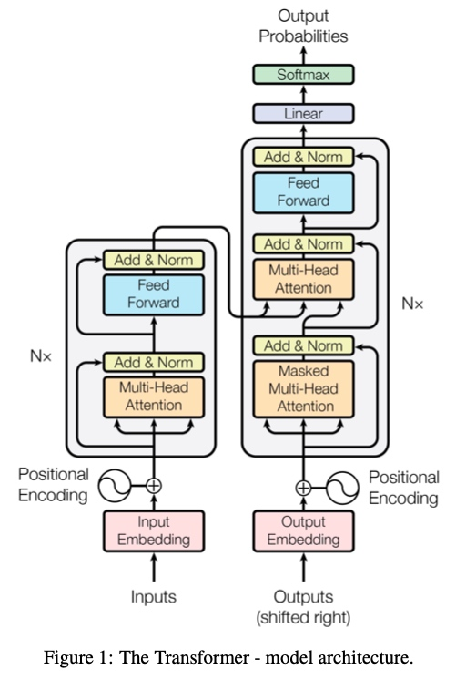
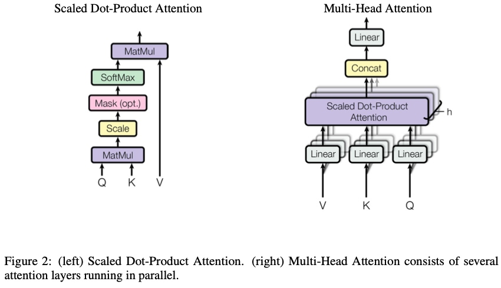

# Attention is all you need
### Basic Info
| Item| Info                                      |
|:------:|:-------------------------------------------:|
| Status | Detail                                      |
| Rate   | 5                                           |
| Type   | Conference                                  |
| Where  | NIPS                                        |
| When   | 2017                                        |
| Code   | https://github.com/tensorflow/tensor2tensor |
| Date   | 09/04/2022                                  |
### Bibtex:
```
@inproceedings{NIPS2017_3f5ee243,
author = {Vaswani, Ashish and Shazeer, Noam and Parmar, Niki and Uszkoreit, Jakob and Jones, Llion and Gomez, Aidan N and Kaiser, \L ukasz and Polosukhin, Illia},
booktitle = {Advances in Neural Information Processing Systems},
editor = {I. Guyon and U. Von Luxburg and S. Bengio and H. Wallach and R. Fergus and S. Vishwanathan and R. Garnett},
pages = {},
publisher = {Curran Associates, Inc.},
title = {Attention is All you Need},
url = {https://proceedings.neurips.cc/paper/2017/file/3f5ee243547dee91fbd053c1c4a845aa-Paper.pdf},
volume = {30},
year = {2017}
}
```

## Model Architecture

### Encoder
#### Each sub-layer
$Norm(x+SubLayer(x))$
#### Attention Mechnism

Q: query; K: key; V: values.
**Scaled dot-product attention**: 
```math
Attention(Q, K, V)=softmax(\frac{QK^T}{\sqrt{d_k}})V
```
scaling operation is to prevent the saturation and gradient vanishing of activate functon.
**Multi-head Attention**: 
```math
MultiHead(Q, K, V)=Concat(h_1, h_2,...,h_h)W^O
```
where $h_i$ is $Attention(QW^Q_i, KW^K_i, VW^V_i)$. Ws are projection matrices.
### Feedfoward
```math
FFN(x)=max(0,xW_1+b_1)W_2+b_2
```
Two linear transformation + one ReLU layer
### Position Encoding
To make full use of position information.
```math
PE_{(pos,2i)}=sin(pos/10000^{2i/d_{model}})
```
```math
PE_{(pos,2i+1)}=cos(pos/10000^{2i/d_{model}})
```
That is, each dimension of the positional encoding corresponds to a sinusoid. The wavelengths form a geometric progression from 2π to 10000 · 2π. We chose this function because we hypothesized it would allow the model to easily learn to attend by relative positions, since for any fixed offset k, $PE_{pos+k}$ can be represented as a linear function of $PE_{pos}$.

## Why self-attention
- the total computational complexity per layer. 
- the amount of computation that can be parallelized, as measured by the minimum number of sequential operations required.
- the path length between long-range dependencies in the network.

## Training configuration
See paper for details.
